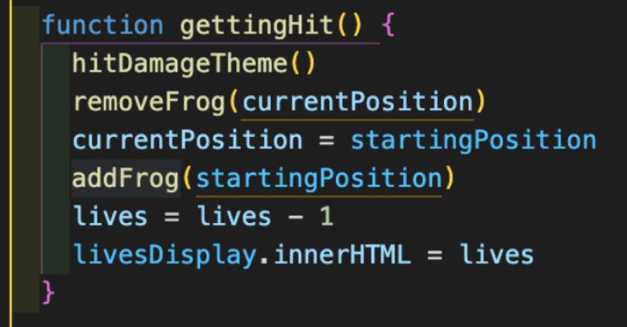

## **Project 1 – Frogger**

Frogger is a game based on the original Frogger game which was developed by Konami on the 12th January 1981. In this game, you must cross through traffic and avoid cars, in order to reach and eat a fly at the end. When you eat a fly, you return to the starting position. Once all four flies have been eaten, you win the game.

Frogger

### **Overview**
I had to build a grid-based game in one week, by using HTML, CSS, and JavaScript. My game is based on avoiding collisions with car objects and eating fly objects. Controls of the game are arrow buttons. It was a solo project.

### **Technologies**

#### **HTML**
- Grid with cells, height – 8, width – 9.
- Start Button.
- Score, flies eaten and lives display.
- Audio for getting hit, eating a fly, winning the game, losing the game and soundtrack for the game.
- Favicon display in the browser tab.

#### **CSS**
- Styling and structuring the grid, using flexbox and other visual enhancements.
- Pop up window, which displays a background and name/logo of the game.

#### **JavaScript**
- `OnClick` event to start the game and display the grid.
- `SetInterval` to move the objects and add collisions with cars.
- Hide and show a pop up screen.
- KeyUp function, to move the character and add collision with cars.

### **Day to day progress**

Day 1 – My plan could have been a bit better, but because it was my first project, I wasn't used to planning in this manner. I used my notes and what I have learned previously to plan which main function I will need to use. Also, I created a grid and used a flex box, because it helped me to visually see what I will need to do later on.

I defined the width and height of the grid, then I multiplied width and height and stored the value inside the `cellCount`. Then I created a variable called `cells` and the value of it was an empty array.

Here I am creating a function called `createGrid` which creates the grid where the game will be played. I used a `for` loop to iterate through the grid. Each time the index increases by 1, it creates a `div` and assigns it to the `cell` variable. Lastly, it would push `cell` inside the `cells` which was defined as an empty array previously.

Day 2 – I added all characters and movement function as well as starting the game function. 

First I assigned starting position and current position to the frog (player character)

Then, I added two functions, adding and removing the frog.

At this point I was able to create a `playerMovement` function by using the `keyCode` property. I was able to bind the keys by using `console.log`. Then, I used conditional logic to make the character move and change its `currentPosition` according to the key bind. Also, I am removing the character’s current position and then adding `currentPosition` back once the key is pressed.

Day 3 – I added obstacles and made them move, while also making collisions happen, so whenever my character touches the car/obstacle, 1 life is lost. Also, I added an end game function as well, which will be triggered when all 3 lives are lost. Then it will trigger a window alert which will show this text “You lost!! Score 0”

First, I created `gettingHit` and `eatingFly` functions. `gettingHit` function brings the player back to the starting position and removes a life.

This is the `endGame` function. It clears the interval, resets characters position to the starting position. Then if the live counter is 0, trigger the pop up alert saying “You lost” and the score will be displayed. Otherwise if all 4 flies are eaten, display a pop up window saying “You win” and the score will be displayed.

Then I moved on to create obstacles and made them move. First of all, I set the position where the car objects will be positioned, and the gap they will have between other cars in the same row.

Here I am using the slice method to set which direction they will be moving and then using an index and a remainder to make the car move. Also, I am checking if the car moves into the cell that the character is standing on, if so the `gettingHit` function will be triggered.

Here I am adding another collision instance, this is when the player character steps on the cell that contains a car, `gettingHit` function will be triggered. This was done for all 4 car objects, exactly the same way. 

Day 4 – I added flies that will have to be eaten by the frog, which then would update score and flies eaten meter. Also, I added a function that once the flies were eaten or collision with another object happened, the character would have to be brought back to starting position. Furthermore, I added a win game function, which will be triggered once the player eats all 4 flies and a window alert will pop up and say “You win!! Score 400”

I created the `eatingFly` function, which adds 100 points to the score and adds 1 fly to the fly display.

This is a function which recognises whether the character is standing on the same cell as the fly. Once that condition is met, `eatingFly` function will be triggered, then `removeFly` and `removeFrog` functions will be triggered. Then, the character's position is changed to `startingPosition` and the frog is added to that position.

Day 5 – Finally, I built a pop up screen and added sound effects. Also, I did a bit of styling on CSS.

### **On page load**
When the page loads, there is an overlay which displays the logo, rules of the game, as well as the start button.

### **When the game starts**
- The soundtrack of the game starts to play.
- Pepe the frog is activated and is able to move.
- Objects start moving.
- When being hit by an object a sound is activated and once a fly is eaten, a different sound is also activated.

### **Character movement**
keyUp function is used in order to move the character up, down, right, left.
It is also used to prevent the character moving out of the grid, or warping through “walls”.
It checks if the position where the character is currently standing in, contains an object of a car. If it does, then you lose a life and get returned to the starting position.
Also, it checks if a character's position contains a fly, if it does, the score of 100 is added and flies eaten is added by 1. Then the character is returned to the starting position.
When all flies are eaten, the player wins the game or if all 3 lives are lost, then the player loses.
If it's a win, a window alert pops up which says: “You win!! Your score is 400”
If it's a loss, a window alert pops up which says: “You lose!! Your score is x” (Score depends on how many flies you have eaten. Fly = 100 points)

### **Winning screen**

### **Losing screen**

### **Key learnings**
- Learned how to make a grid dynamically using JavaScript.
- Learned how to use Flex-box, because previously I had trouble manipulating content on the screen the way I wanted.
- Learned how to use play() and pause() functions to control the audio.
- Learned how to move objects with setInterval.
- Learned how to create a pop-up using JavaScript, CSS, and HTML.

### **Challenges**
- Placing 4 flies on specific cells.
- Making objects move.
- Returning character to starting position after collision or eating a fly.

### **Future improvements**
- Add water and logs, like in the original Frogger game, where if you step in water you lose a life, and the only way to cross to the other side where the fly is, you have to step on the log.
- Potentially bigger grid, so more objects could be included.
- More levels, and potentially use a time limit as well. Then, based on remaining time, the player could get extra points when the level is cleared. For example, 10 points for every second remaining.

### **Bugs**
- Did not come across any bugs.

### **Wins**
- Created a fully working browser game.
- Adding many different sound effects that went well with the game.

